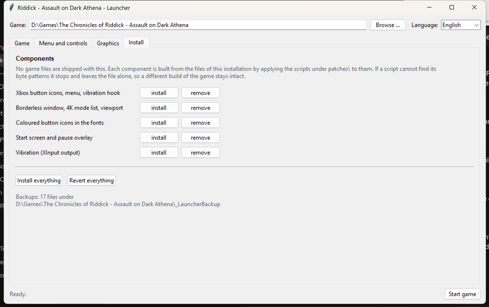

# Riddick AoDA Toolkit

Ein Launcher mit Eingriffen für die PC-Fassung von **The Chronicles of
Riddick: Assault on Dark Athena** (2009). Er holt das Spiel an die
Xbox-360-Fassung heran und behebt mehreres, was der PC-Port liegengelassen
hat.

> **Es liegen keine Spieldateien in diesem Projekt.** Jede Änderung wird aus
> den Dateien der vorhandenen Installation berechnet. Im Projekt steht
> ausschließlich eigener Quelltext.

*English version: [README.md](README.md)*



---

## Was es macht

**Xbox-360-Knopfsymbole überall.** Menüs, Eckhinweise und Fließtext benutzen
die Originalgrafiken der 360, die im PC-Build mitgeliefert, aber nie gezeigt
werden. Die flaueren `_32`-Fassungen, zu denen der PC greift, werden durch die
richtigen ersetzt. Die Hilfe liegt auf L3 mit einem eindeutigen Stick-Symbol,
die Nachtsicht auf dem Steuerkreuz oben.

**Vibration, die funktioniert.** Der PC-Port liefert die vollständigen
Hüllkurven mit — `Content\Feedback\feedback.xrg` ist bytegleich mit der Datei
der Xbox-360-Fassung —, aber keine Ausgabe: `XInputSetState` kommt in keiner
PC-Binärdatei vor, während die 360-Programmdatei `XamInputSetState`
importiert. Eine kleine Hilfs-DLL (`rumble/`, Quelltext dabei) liest diese
Hüllkurven, mischt bis zu acht gleichzeitige Effekte mit 60 Hz und bedient
beide Motoren.

**4K ohne Balken.** Der Renderer zählte die Anzeigemodi auf und brach nach 512
Einträgen ab. Auf einem heutigen Rechner meldet Windows rund 650 Modi, und
3840×2160 liegt weit hinten — das Spiel hat es also nie gesehen und ist auf
1920×1440 zurückgefallen. Das ist 4:3, daher die Balken. Die Grenze
hochgesetzt, den Fensterrahmen entfernt und die Viewport-Rechnung berichtigt
ergibt ein formatfüllendes, unverzerrtes Bild.

**Shader-Verträglichkeit.** `System\GL\HLInclude_GLSL.xrg` benutzt die
dreiargumentige Form von `texture2D`/`textureCube`. Die ist im Fragment-Shader
nicht zulässig; neuere Treiber weisen sie ab, und das Spiel bricht beim Start
in `CRenderContextGL::GLSL_LoadSrc` ab. Der Launcher kann den Behelf setzen
und wieder zurücknehmen.

**Zielhilfe, die sich wirklich abschalten lässt.** Der Regler im Optionsmenü
ist wirkungslos: sein Wert wird gelesen, mit dem Schwierigkeitsgrad verrechnet
und abgelegt — die Zielrechnung fragt ihn nie ab. Wirksam ist die Waffenflagge
`autoaim` an 23 Waffen, und genau die schaltet der Launcher.

**Hauptmenü umschaltbar.** Sechs Bytes in `MSystem.dll` entscheiden, welche
`PLATFORM_`-Symbole der Registry-Präprozessor setzt. Zwischen PC-Cube und
Konsolenmenü lässt sich jederzeit wechseln.

**Grafikeinstellungen.** Alle Schlüssel, die die Engine wirklich aus der
`Environment.cfg` liest, mit dem auswertenden Modul und dem Vorgabewert —
beides aus den Binärdateien abgelesen, nicht geraten.

---

## Voraussetzungen

* Windows, Python 3 mit tkinter (in der üblichen Installation von python.org
  enthalten)
* **Pillow** — nur für den Bestandteil *Schrift*, der die Knopfgrafiken in die
  Schriftatlanten des Spiels einrechnet: `pip install pillow`
* MSVC Build Tools — nur, wenn die Vibrations-DLL selbst gebaut werden soll;
  eine übersetzte Fassung liegt bei

## Starten

```
RiddickLauncher.cmd
```

Beim ersten Start `<Spiel>\System\Win32_x86\DarkAthena.exe` wählen. Alle
weiteren Pfade ergeben sich daraus. Die Wahl und die Sprache der Oberfläche
(Deutsch / English) werden in
`%LOCALAPPDATA%\RiddickLauncher\launcher.json` gemerkt.

## Sicherungen

Jede Datei bekommt vor der ersten Änderung eine Kopie unter
`<Spiel>\_LauncherBackup\`, mit gleicher Verzeichnisstruktur. **Alles
zurücknehmen** spielt jede dieser Kopien zurück und entfernt alles
Hinzugefügte. Die `Environment.cfg` liegt außerhalb des Spielordners, unter
`%LOCALAPPDATA%\Atari\...`, und bekommt eine eigene Sicherung.

## Bestandteile

| Bestandteil | Was angefasst wird |
|---|---|
| `kern`    | GameClasses, GameWorld, MSystem, CubeWnd.xrg, CubeInv0.xrg |
| `grafik`  | RndrGL.dll — randloses Fenster, 4K-Modusliste, Viewport |
| `schrift` | Text.xfc, Subtitle.xfc, Headings.xfc — farbige Knopfsymbole |
| `texte`   | Frontend- und StringsX360-Tabellen |
| `rumble`  | RiddickRumble.dll + .ini |

Jeder wird von den Skripten unter `patches/` erzeugt. Die laufen auch einzeln —
jedes nimmt einen Pfad und kennt `--apply` und `--restore`.

## Aufbau

```
RiddickLauncher.pyw   die Oberfläche
rmod.py               die Logik: Pfade, Sicherungen, Bestandteile, Einstellungen
sprachen.py           Deutsch / English
patches/              die Eingriffe, je Thema ein Skript
rumble/               Vibrations-DLL, C-Quelltext und eine übersetzte Fassung
tools/                fix_riddick_dds.py — repariert DDS-Dateien, die der
                      Exporter des Spiels falsch schreibt (falscher FourCC,
                      Mip-Zähler um eins zu hoch)
docs/                 was die Untersuchung ergeben hat
```

## Einschränkungen

* Gebaut gegen die Handelsfassung für PC. Die Skripte prüfen ihre Bytemuster
  und fassen eine Datei nicht an, die sie nicht wiedererkennen — eine andere
  Spielfassung bleibt also unberührt statt beschädigt.
* `XR_SHADERMODE` steht in der ausgelieferten `Environment.cfg` auf `11`,
  außerhalb des gültigen Bereichs 0–6. Der Launcher weist darauf hin; auf
  einer frischen Installation stürzt das Spiel allein deswegen ab.

## Lizenz

MIT, siehe [LICENSE](LICENSE). Das gilt für den Quelltext in diesem Projekt.
Es ist ein Werkzeug, das eine Installation ändert, die einem selbst gehört; es
enthält und verbreitet keinen Teil des Spiels.

Dies ist ein inoffizielles Werkzeug aus der Fangemeinde. Es steht in keiner
Verbindung zu Starbreeze Studios, Atari oder heutigen Rechteinhabern und ist
von ihnen weder unterstützt noch gebilligt. *The Chronicles of Riddick* und
alle zugehörigen Namen gehören ihren jeweiligen Eigentümern.
